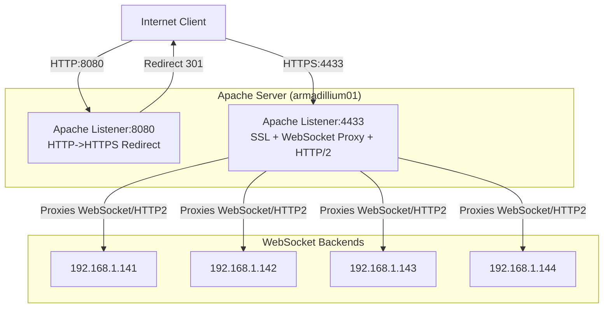

# HArmadillium Apache Configuration

This repository contains the Apache configuration file `000-default.conf`, which is part of a high-availability cluster setup for the `HArmadillium` project. Below is an overview of the configuration and a visual schema for clarity.

---

## Architecture Schema



---

## Overview

The `000-default.conf` file provides the following features:
- **HTTP to HTTPS Redirection**: Redirects HTTP traffic on port 8080 to HTTPS.
- **Load Balancing for WebSocket Connections**: Utilizes multiple upstream servers for efficient WebSocket traffic distribution.
- **SSL Configuration**: Includes SSL certificate and key settings for secure communication.
- **Timeout and Header Settings**: Optimized for WebSocket support.
- **HTTP/2 Enhancement**: Enables HTTP/2 for better performance and efficiency.

## Prerequisites

Ensure the following Apache modules are enabled:
- `mod_ssl`
- `mod_proxy`
- `mod_proxy_balancer`
- `mod_proxy_http`
- `mod_proxy_wstunnel`
- `mod_headers`
- `mod_http2`
- `mod_lbmethod_byrequests`

You can enable these modules using the following command:
```bash
sudo a2enmod ssl proxy proxy_balancer proxy_http proxy_wstunnel headers http2 lbmethod_byrequests
```

## Configuration Details

### HTTP to HTTPS Redirection
The configuration redirects HTTP traffic on port 8080 to HTTPS:
```apache
<VirtualHost *:8080>
    ServerName armadillium01
    Redirect 301 / https://armadillium01:4433/
</VirtualHost>
```

### Load Balancing for WebSocket Connections
Upstream servers for WebSocket traffic are defined as follows:
```apache
<Proxy "balancer://websocket">
    BalancerMember http://192.168.1.141
    BalancerMember http://192.168.1.142
    BalancerMember http://192.168.1.143
    BalancerMember http://192.168.1.144
</Proxy>
```

### HTTPS Configuration
The HTTPS configuration enables SSL and provides WebSocket proxy settings. **All ProxyPassReverse directives have been updated to ensure correct HTTPS reverse proxying.**
```apache
<VirtualHost *:4433>
    ServerName armadillium01
    DocumentRoot "/var/www/html"

    # SSL Settings
    SSLEngine on
    SSLCertificateFile /etc/apache2/ssl/host.cert
    SSLCertificateKeyFile /etc/apache2/ssl/host.key

    # Enable HTTP/2
    Protocols h2 http/1.1

    # Proxy settings for WebSocket and HTTP
    <Location />
        ProxyPass "balancer://websocket/"
        ProxyPassReverse "balancer://websocket/"
        RequestHeader set X-Real-IP %{REMOTE_ADDR}s
        RequestHeader set Host %{HTTP_HOST}s
        RequestHeader set X-Forwarded-For %{X-Forwarded-For}s
        RequestHeader set X-NginX-Proxy true
        ProxyPreserveHost On
    </Location>

    # Timeout settings
    Timeout 86400
    ProxyTimeout 86400
</VirtualHost>
```

### Key Points for Reverse Proxy in HTTPS

- `ProxyPassReverse` should always match the protocol and path used in the `ProxyPass` directive. 
- Since backend members are using HTTP, but the frontend is HTTPS, Apache will handle the translation automatically as long as the `ProxyPassReverse` points to the correct balancer namespace, as shown above.
- If you have any absolute redirects from your backend services, ensure those services generate URLs beginning with `https://armadillium01:4433/` (or your actual FQDN and port).

## Notes
- Replace `armadillium01` with your server's fully qualified domain name (FQDN) or IP address.
- Ensure [SSL certificates](https://github.com/universalbit-dev/HArmadillium/tree/main/ssl) are correctly placed at `/etc/apache2/ssl/`.
- If you change backend addresses or add SSL to backend servers, update the `<Proxy>` section accordingly.

---
