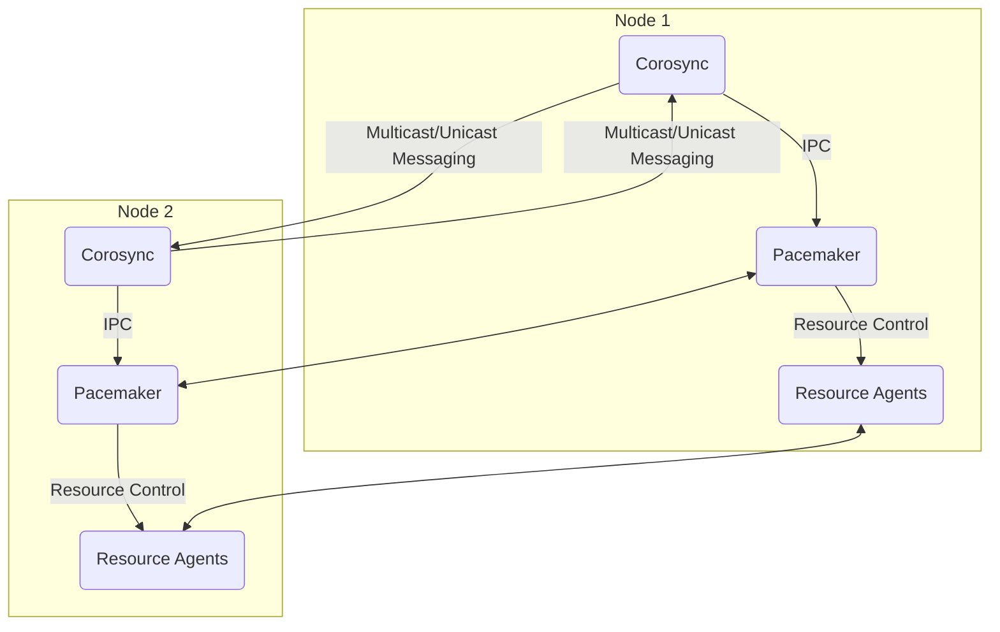

## Corosync in HArmadillium

HArmadillium is a comprehensive solution for configuring and managing High Availability (HA) clusters. Corosync forms the foundation of the cluster communication stack but is only one part of the full solution.

This directory contains resources and scripts related to Corosync, including configuration and deployment.

---

## Script: `generate_and_deploy_corosync.sh`

For automating the configuration and deployment of Corosync, a dedicated script, `generate_and_deploy_corosync.sh`, has been provided. This script simplifies the Corosync setup process and ensures consistency.

For detailed instructions and usage, refer to the [generate_and_deploy_corosync.md](https://github.com/universalbit-dev/HArmadillium/blob/main/corosync/generate_and_deploy_corosync.md) guide.

---

## Configuring Pacemaker (PCMK) Service in Corosync

To fully integrate Pacemaker with Corosync, follow these steps:

### 1. Create the `PCMK` File
Run the following commands to create the `pcmk` service configuration file:

```bash
sudo mkdir -p /etc/corosync/service.d
sudo nano /etc/corosync/service.d/pcmk
```

### 2. Add the Service Configuration
Add the following content to the `pcmk` file:

```plaintext
service {
  name: pacemaker
  ver: 1
}
```

### 3. Important Considerations
- Ensure this step is performed **after** generating the `corosync.conf` file.
- Make sure the `corosync-keygen` file is properly generated and copied to the appropriate location.

---

## HA Cluster Architecture

Below is a Mermaid schema representing the relationship between key components in the HArmadillium HA cluster:



**Legend:**
- **Corosync**: Handles cluster communication and membership.
- **Pacemaker**: Manages resources and cluster state.
- **Resource Agents**: Scripts or binaries that manage individual resources (services, IPs, etc).
- **Multicast/Unicast Messaging**: Corosync nodes communicate with each other.
- **IPC**: Inter-process communication between Corosync and Pacemaker.
- **Resource Control**: Pacemaker instructs resource agents to start/stop resources.

---

## Notes

Corosync is only part of the HArmadillium HA cluster configuration. To complete the setup, additional components such as PCS and resource agents must also be configured. Refer to the main repository and documentation for complete instructions.

---
