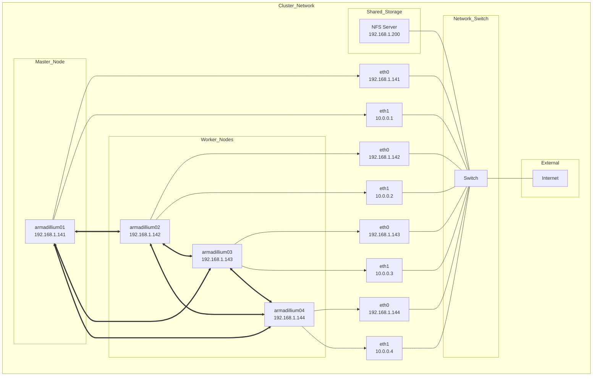

### Hostname and `/etc/hosts` in Ubuntu

#### **What is a Hostname?**
A **hostname** is a human-readable label assigned to a device on a network. It uniquely identifies a machine and allows devices to communicate with each other using names instead of IP addresses. In a cluster, hostnames make it easier to reference and manage each node.

For example, the hostnames in the HArmadillium cluster are:
- `armadillium01`
- `armadillium02`
- `armadillium03`
- `armadillium04`

These hostnames correspond to individual nodes in the cluster.

---

#### **What is `/etc/hosts`?**
The `/etc/hosts` file is a local configuration file used to map hostnames to IP addresses. It provides a static way to resolve hostnames without relying on an external DNS server. This is especially useful in small networks or clusters where DNS may not be available or desired.

---

#### **Functions of `/etc/hosts`**
1. **Local Name Resolution**: Maps hostnames to their corresponding IP addresses for use within the local network.
2. **Simplifies Communication**: Enables nodes to communicate with each other using human-readable names instead of hard-to-remember IP addresses.
3. **DNS Fallback**: Acts as a backup in case DNS servers are unreachable or not configured.

---

#### **Configuring `/etc/hosts` for HArmadillium**
To ensure seamless communication in the HArmadillium cluster, you need to edit the `/etc/hosts` file on each node to map the hostnames to their respective IP addresses. Below is the configuration example:

```plaintext
192.168.1.141 armadillium01
192.168.1.142 armadillium02
192.168.1.143 armadillium03
192.168.1.144 armadillium04
```

This ensures that each node can be referenced by its hostname, simplifying cluster management.

---

#### **Cluster Topology: Visual Schema**

This illustrates how each node is connected within the cluster and how hostnames relate to their IP addresses:



---

#### **Steps to Edit `/etc/hosts` in Ubuntu**
Follow these steps to configure the `/etc/hosts` file on each node:

1. Open the `/etc/hosts` file with a text editor (e.g., `nano`):
   ```bash
   sudo nano /etc/hosts
   ```
2. Add or update the following lines:
   ```plaintext
   192.168.1.141 armadillium01
   192.168.1.142 armadillium02
   192.168.1.143 armadillium03
   192.168.1.144 armadillium04
   ```
3. Save and close the file:
   - In `nano`, press `CTRL+O` to save and `CTRL+X` to exit.
4. Verify the changes by pinging a hostname:
   ```bash
   ping armadillium01
   ```

---

#### **Best Practices**
- **Ensure Consistency**: The `/etc/hosts` file should be identical across all nodes in the cluster to avoid communication issues.
- **Backup Before Editing**: Always create a backup of the `/etc/hosts` file before making changes:
  ```bash
  sudo cp /etc/hosts /etc/hosts.bak
  ```
- **Use Descriptive Hostnames**: Use meaningful hostnames that clearly specify the role or identity of each node in the cluster.

---
