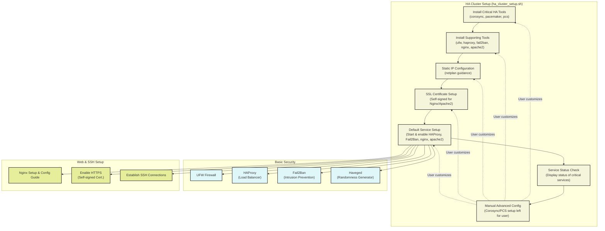

## 📢 Support the UniversalBit Project
Help us grow and continue innovating!  
- [Support the UniversalBit Project](https://github.com/universalbit-dev/universalbit-dev/tree/main/support)  
- [Learn about Disambiguation](https://en.wikipedia.org/wiki/Wikipedia:Disambiguation)  
- [Bash Reference Manual](https://www.gnu.org/software/bash/manual/)

---

#### Unlimited Digital Development Environment for High Availability Clusters
<p align="center">  </p>



---
<p>
  
</p>

# High Availability Clusters 
* [HArmadillium](https://github.com/universalbit-dev/armadillium/blob/main/HArmadillium.md)
* [HA Cluster Setup](https://github.com/universalbit-dev/HArmadillium/blob/main/ha_cluster_setup.sh)

The `ha_cluster_setup.sh` script is a **beginner-friendly starting point** for setting up a High Availability (HA) cluster. It simplifies and accelerates the installation process by automating the basic steps while skipping detailed configurations for advanced tools like `corosync` and `pcs`. This allows users to quickly install required components and focus on further customization later.

### Key Features for Beginners:
1. **Basic Installation**:
   - Installs critical HA tools like `corosync`, `pacemaker`, `pcs`, and supporting tools such as `ufw`, `haproxy`, `fail2ban`, `nginx`, and `apache2`.
   - Automates dependency installation, reducing manual setup time.

2. **Static IP Configuration**:
   - Guides users through setting up a static IP with a generated `netplan` configuration.
   - Ensures the system is network-ready before starting advanced HA configurations.

3. **SSL Certificate Setup**:
   - Includes a simple method for generating self-signed SSL certificates for Nginx and Apache2.
   - Ensures HTTPS readiness without requiring external certificate management.

4. **Default Service Setup**:
   - Starts and enables basic services like `HAProxy`, `Fail2Ban`, `nginx`, and `apache2` with minimal configurations.
   - Provides example configurations for Nginx and Apache2 to get services running quickly.

5. **Service Status Check**:
   - Displays the status of critical services at the end, helping users verify that the basic setup is complete.

### Key Note:
- **Corosync and PCS**: While these tools are installed, **no advanced cluster configuration is included**. Users will need to configure `corosync` and `pcs` manually based on their specific HA cluster requirements.
- **Purpose**: The script is focused on **speeding up the initial setup** rather than providing a fully configured HA environment.

This script is an excellent tool for beginners who want to quickly set up the foundational components of an HA cluster and explore further configurations at their own pace.
##### [Introduction-to-High-Availability](https://ubuntu.com/server/docs/introduction-to-high-availability)


* [Nginx Setup](https://github.com/universalbit-dev/HArmadillium/blob/main/HArmadillium.md#webserver) — [Nginx Configuration Guide](https://github.com/universalbit-dev/HArmadillium/blob/main/HArmadillium.md#nginx-configuration)  
* [Enable HTTPS with Self-Signed Certificate](https://github.com/universalbit-dev/HArmadillium/blob/main/HArmadillium.md#self-signed-certificate-https-with-openssl)  
* [Establish SSH Connections](https://github.com/universalbit-dev/HArmadillium/blob/main/HArmadillium.md#ssh-connection-to-communicate-with-all-nodes)  

##### Basic Security (If needed,use this: [SELKS](https://github.com/universalbit-dev/SELKS/pkgs/container/arkimeviewer))
* [UFW](https://manpages.ubuntu.com/manpages/bionic/en/man8/ufw.8.html) -- [UFW Firewall setup](https://github.com/universalbit-dev/HArmadillium/blob/main/HArmadillium.md#ufw-firewall-rules-for-each-node)
* [Haproxy](https://www.haproxy.org/) -- [Haproxy github repository:](https://github.com/haproxy/haproxy/)  -- [Haproxy and Load Balancing Concepts](https://www.digitalocean.com/community/tutorials/an-introduction-to-haproxy-and-load-balancing-concepts)
* [Fail2ban](https://github.com/fail2ban/fail2ban) -- [Protect WebServer with Fail2ban ](https://www.digitalocean.com/community/tutorials/how-to-protect-an-nginx-server-with-fail2ban-on-ubuntu-22-04)
* [Haveged](https://wiki.archlinux.org/title/Haveged#) (Haveged inspired algorithm has been included in the Linux kernel )

```bash
apt install ufw haproxy fail2ban
systemctl enable ufw haproxy fail2ban
```

---


### HappyCoding!
