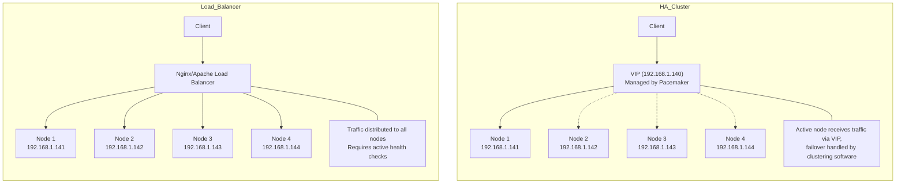

##### Configuring an upstream block in Nginx or Apache with 4 nodes instead of a single Virtual IP (VIP) can work in some scenarios, but it is not an ideal configuration for a High Availability (HA) cluster.

### **Why Using a Single VIP is Preferred**
1. **Load Balancing with a VIP**:
   - A VIP is typically used in HA clusters to represent the active node or service. The clustering software (e.g., Pacemaker) ensures that the VIP always points to the active node.
   - This simplifies the configuration because the client/server only needs to communicate with the VIP, and the clustering software handles failover and availability.

2. **Cluster Node Awareness**:
   - If you configure the upstream block with all 4 nodes' IPs instead of a VIP, Nginx or Apache will treat all nodes as equally available without awareness of their actual health or role in the cluster.
   - If one or more nodes are down, requests might still be sent to those nodes unless additional health checks are configured explicitly.

3. **Failover Management**:
   - A single VIP allows the cluster to handle failover seamlessly. Without a VIP, you rely on the webserver's upstream health-checking mechanism, which may not provide the same level of reliability and coordination as dedicated clustering software.

---
### **Architecture Comparison**



### **Potential Issues with Using 4 Nodes in Upstream**
1. **Uncoordinated Traffic**:
   - Traffic may be distributed to nodes that are not the active node or are not fully synchronized, leading to inconsistent responses or errors.
   
2. **Complexity**:
   - Configuring upstreams for all 4 nodes can make the setup more complex and harder to manage, especially when changes or updates are needed.

3. **Redundancy**:
   - If all nodes are configured in the upstream block, and the service is active only on one node at a time (as is common in HA setups), the other nodes might not serve any traffic unless explicitly synchronized.

---

### **Recommended Solution**
- Stick with the **single VIP (192.168.1.140)** for your Nginx or Apache configuration.
- Ensure that the VIP is managed by the cluster software (e.g., Pacemaker), so it always points to the active node.
- Use the upstream block only if you're implementing a load-balancing strategy where all nodes serve traffic simultaneously (not typical in HA setups for a single service).

---

### **Example Configuration for VIP**
Here’s how you would configure Nginx or Apache using the VIP:

#### **Nginx Example**:
```nginx
server {
    listen 80;
    server_name armadillium01;

    location / {
        proxy_pass https://192.168.1.140; # The VIP (HTTPS)
        proxy_set_header Host $host;
        proxy_ssl_server_name on;
    }
}
```
[HArmadillium Nginx Configuration](https://github.com/universalbit-dev/HArmadillium/tree/main/nginx)

#### **Apache VIP Example**:
```apache
<VirtualHost *:8080>
    ServerName armadillium01
    ProxyPass / https://192.168.1.140/
    ProxyPassReverse / https://192.168.1.140/
    SSLProxyEngine on
</VirtualHost>
```

---

### **If Load Balancing Across Nodes is Required**
If you intend to load-balance traffic across all 4 nodes instead of using a single VIP, configure upstreams carefully and ensure proper health checks:

#### **Nginx Upstream Example**:
```nginx
upstream backend {
    server 192.168.1.141; # Node 1
    server 192.168.1.142; # Node 2
    server 192.168.1.143; # Node 3
    server 192.168.1.144; # Node 4
}

server {
    listen 80;
    server_name armadillium01;

    location / {
        proxy_pass https://backend;
        proxy_set_header Host $host;
        proxy_ssl_server_name on;
    }
}
```

#### **Apache Load Balancing Example**:
```apache
<Proxy "balancer://cluster">
    BalancerMember https://192.168.1.141
    BalancerMember https://192.168.1.142
    BalancerMember https://192.168.1.143
    BalancerMember https://192.168.1.144
</Proxy>

<VirtualHost *:8080>
    ServerName armadillium01
    ProxyPass / balancer://cluster/
    ProxyPassReverse / balancer://cluster/
    SSLProxyEngine on
</VirtualHost>
```

- **Important**: This will distribute traffic across all nodes, and it assumes all nodes are active and synchronized.
---

### **Conclusion**
If your intention is to implement a High Availability (HA) cluster, using a single VIP (192.168.1.140) is the correct approach. Configuring upstreams with 4 nodes may lead to errors or inconsistencies unless all nodes are fully synchronized and health checks are properly set up.
